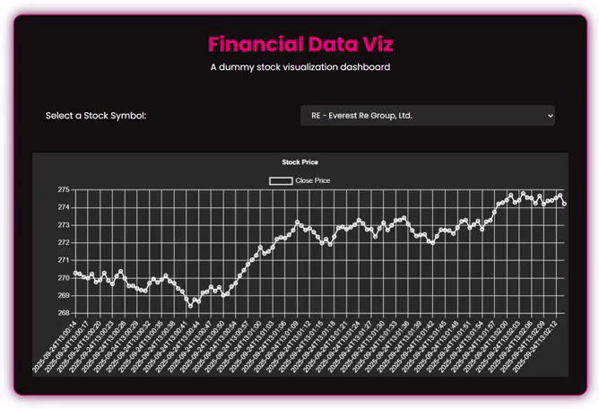
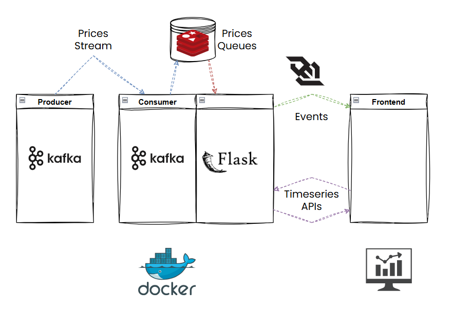

# financial-data-viz

## Purpose
This repository is a toy project aimed at practicing data engineering stacks and pipelines.

For now on, it contains a single application which allow users to display live stock values in a web browser.

As access to real financial APIs is not that straightforward nor free, stocks names are fakes and price values are generated using random walks. No use to run predictive algorithms ;) .

## How to use it
1. Clone this repository
2. From the root folder run `docker-compose up --build`
3. Open `https://127.0.0.1:5000` on your favorite web browser
4. Enjoy selecting your favorite stock symbol and see its price evolving over time in a limited time window (120 seconds).

## Architecture

This python application uses Apache Kafka in a producer-consumer scheme.
The stream is captured by the consumer in a Flask backend.

A Redis server is used to store the events in a persistent and thread-safe way.

The front end is notified of any new data income through WebSockets.

## Caveats and room for later improvements
For now on, events are stored on different queues - one per stock symbol - and a stock timeserie is built only when the API is called for the given stock symbol. This may result in long queues processing time  - and inconvenient timeouts - when a user vizualizes a stock during a long timespan then switch to another.

